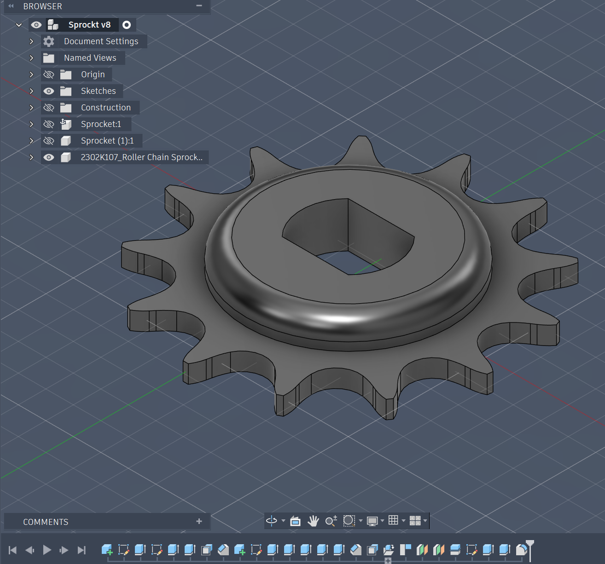
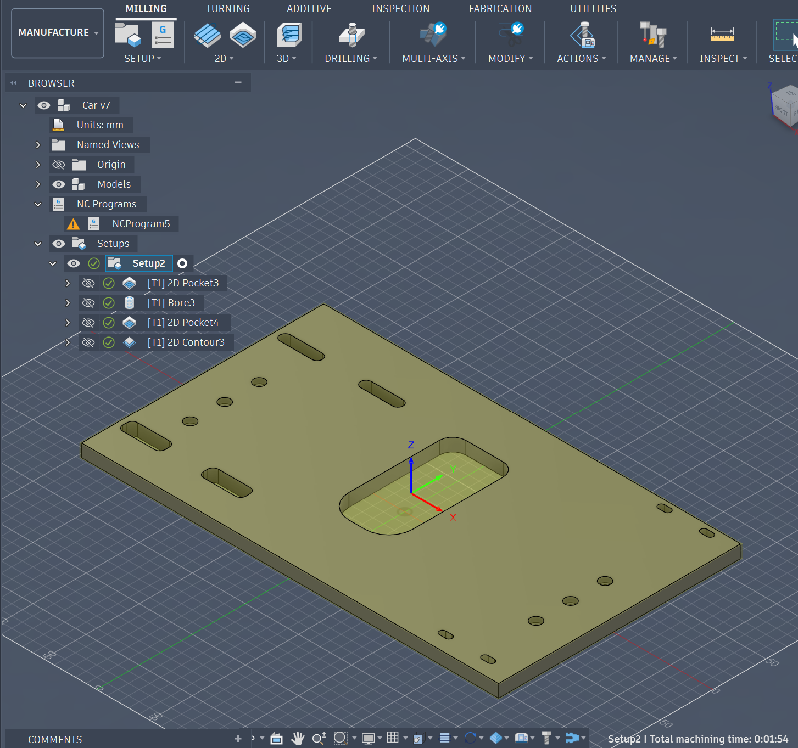
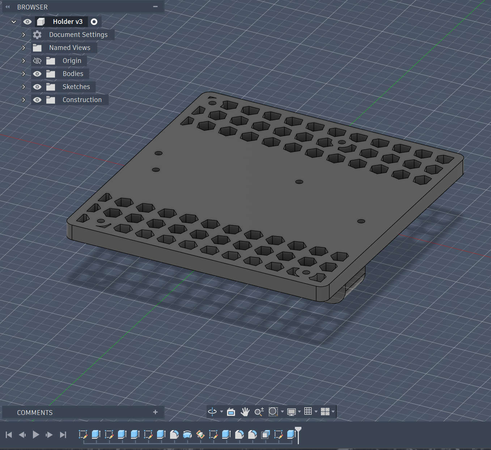
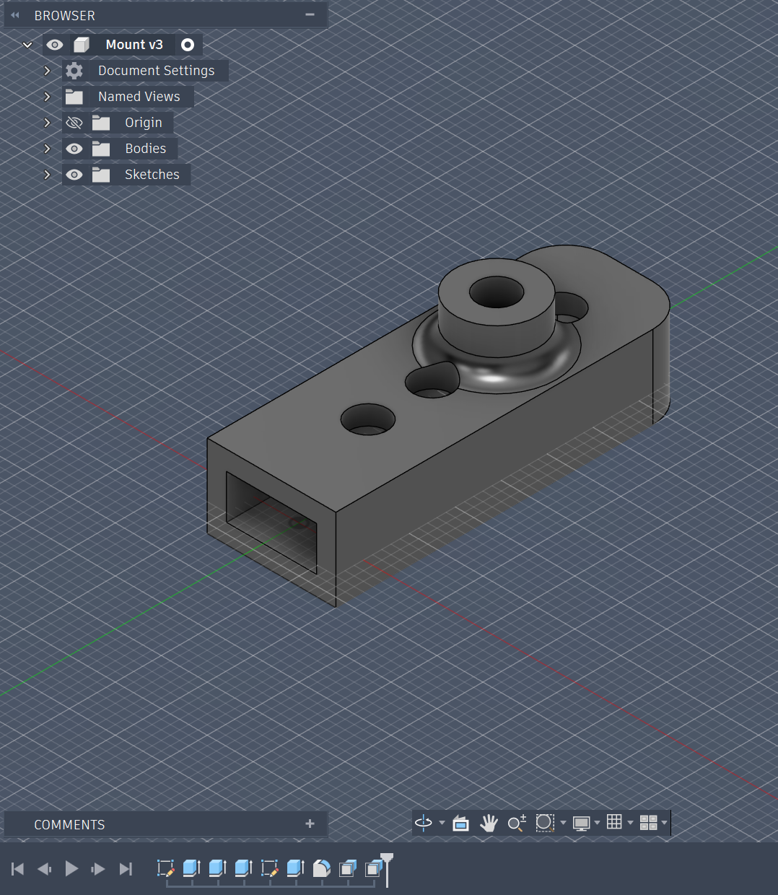
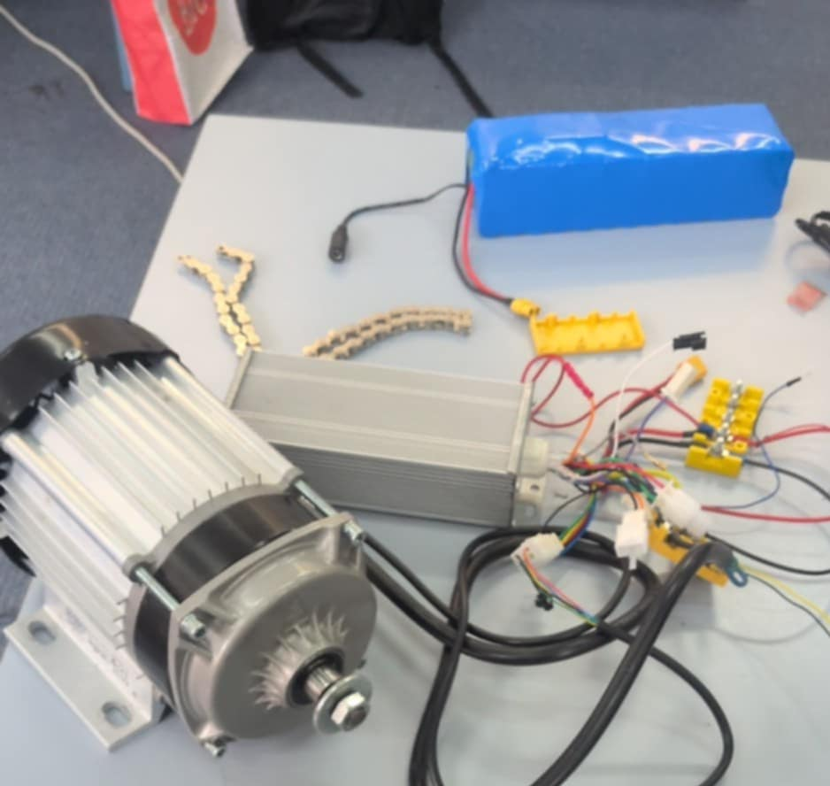

# Electric Go-Kart

A remote-controlled electric go-kart built from scratch over a week, combining custom-fabricated parts with electronic control systems. The project covers the full development process from CAD design through fabrication, wiring, and programming.

## Overview

The goal of this project was to design and build a working electric go-kart that can be driven remotely over Bluetooth. The vehicle uses an Arduino-based control system to manage steering, motor speed, and braking. All mechanical components were 3D printed, and the frame was constructed from wood.

## What I Did

I handled every stage of this build:

- **CAD Design** - Modeled the full assembly in Fusion 360, including custom motor mounts, steering geometry, and a drive sprocket sized to match the chain.
- **Fabrication** - Cut and assembled the wooden chassis using CNC machine, then 3D printed the custom gears and mounting brackets.
- **Wiring** - Designed and installed the electrical system, connecting a brushless DC motor controller, a steering servo, and a 3-channel relay setup used for braking.
- **Programming** - Wrote the Arduino code in C++ to handle Bluetooth input, control motor speed through a DAC output, manage direction switching, and automatically brake if the signal is lost.

## How It Works

The kart receives commands over Bluetooth (or USB) in the format `angle;speed;direction`. The Arduino parses these values and controls three systems:

1. **Steering** - A servo motor turns the front wheels. The input angle is mapped to a calibrated range to account for mechanical offset.
2. **Motor** - Speed is sent to the motor controller as an analog voltage using the Arduino's DAC. The value is scaled from a minimum threshold up to full output.
3. **Braking** - Three relays act as a braking system. When the kart should stop, the relays cut power and apply braking. A short delay prevents the brakes from toggling too quickly.
4. **Safety Timeout** - If no input is received for 1.5 seconds, the kart automatically centers the steering, kills the motor, and engages the brakes.

## Drivetrain Specifications

The drivetrain uses a custom 3D-printed sprocket designed with the following parameters:

| Parameter          | Value  |
|--------------------|--------|
| Chain Pitch        | 20 mm  |
| Number of Teeth    | 14     |
| Roller Diameter    | 5 mm   |
| Sprocket Thickness | 4 mm   |

## File Structure

```raw
car.ino              Main Arduino code
configble/
  configble.ino      Utility sketch for configuring the Bluetooth module via AT commands
pictures/            Project photos documenting the build process
README.md            This file
```

## Project Gallery

### Design Phase

CAD models created in Fusion 360, showing the frame layout and steering geometry.






### Build Process

Initial construction of the wooden frame and chassis.




### Wiring and Electronics

The electronic setup, including the Arduino, relay modules, motor controller, and cable routing.


### Completed Build

The fully assembled go-kart.


## Tools and Technologies

- Fusion 360 (CAD)
- Arduino (C++)
- 3D Printing
- Brushless DC Motor and ESC
- Bluetooth Serial (HC-05 / HM-10)
- Relay Modules
- Servo Motor
